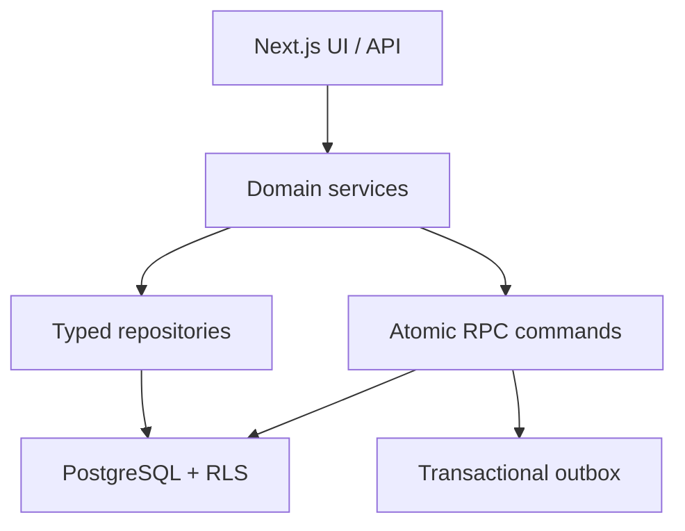

# Canonical Architecture

Next.js server routes/actions call domain services. Reads use scoped Supabase
queries. State-changing multi-row commands use PostgreSQL RPC functions.
PostgreSQL constraints, RLS and Storage policies are authoritative for
concurrency and data boundaries. The outbox is the source for asynchronous
delivery; audit rows are append-only.

Canonical sources:

- legal organization: `Organization`
- brand: `Brand` after the forward brand migration
- property/building/unit: `Property`, `Building`, `Unit`
- application: `Application` plus immutable `ApplicationSnapshot`
- reservation: `Reservation`
- lease artifact: `Contract` plus immutable `ContractVersion`
- signed evidence: `SigningSession`, `ContractSignature`, `EvidenceReport`
- asynchronous work: `OutboxEvent`
- audit: `AuditEvent`

Forbidden: frontend-owned state transitions, full-table reads followed by Node
filtering, fake transactions, wildcard projections, service-role code in the
browser, public private documents, and duplicate/fallback domain engines.

The legacy generic adapter was removed on 2026-07-25. `scripts/lint.mjs` and
the production-hardening suite block its file, import and query patterns from
returning.
